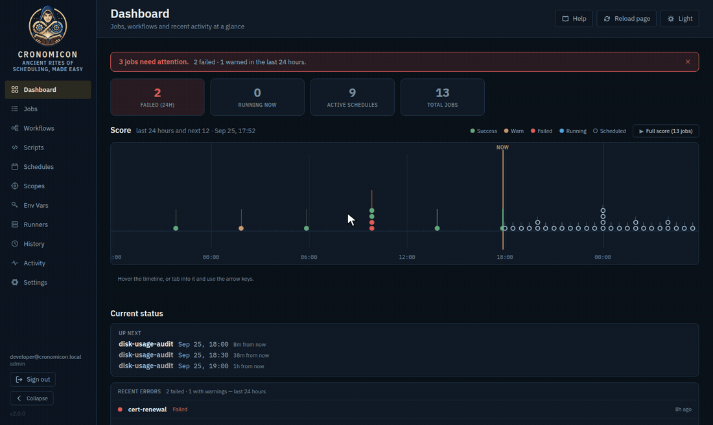

<h1 align="center">
  
</h1>

<p align="center">
  
</p>

<p align="center">
  <a href="CHANGELOG.md"></a>
  <a href="https://cronomicon.io/docs/"></a>
  <a href="https://github.com/ResetSmith/cronomicon/pkgs/container/cronomicon"></a>
  <a href="LICENSE"></a>
</p>

Cronomicon is a self-hosted **script orchestrator**. It schedules and runs Bash, Ansible, Terraform, PowerShell, Perl and Python jobs across your servers from a single web console, and records every run: who or what started it, where it ran, what it printed and how it ended.

It is built for teams that have outgrown crontabs scattered across hosts. Several departments can share one installation, each running its own jobs on its own networks under its own credentials, without seeing each other's work.

Cronomicon runs as **one Go binary with one SQLite database**. There is no message broker or separate database server to operate. Optional **runner agents** extend execution into isolated networks.

**Highlights**

- **Six ways to start a run.** A schedule, a click, a Git push, an API call, another run finishing, or a file arriving.
- **Workflows.** Chain jobs in sequence or in parallel, branch on results, pass values between steps and reuse common sequences.
- **Definitions in Git or in the app.** Keep jobs as reviewed YAML in a Git repository, or build them in the browser. Both run the same way.
- **Departmental access control.** Access comes from your directory groups, scoped per department, with roles you can edit.
- **Secrets by reference.** Jobs name the secrets they need; values are injected at run time from an encrypted store or HashiCorp Vault and masked in every log.
- **Distributed runners.** Agents inside isolated networks pick up only the work meant for them, and install with one command.
- **Operational visibility.** A live dashboard, searchable history with live log tailing, an audit trail, Prometheus metrics, and notifications by email or [Apprise](https://github.com/caronc/apprise).

## Contents

- [Try it locally](#try-it-locally)
- [Deploying Cronomicon](#deploying-cronomicon)
  - [What you need](#what-you-need)
  - [Option 1: Deploy the published image](#option-1-deploy-the-published-image)
  - [Option 2: Build your own image](#option-2-build-your-own-image)
  - [Adding runners](#adding-runners)
  - [Upgrading](#upgrading)
- [How Cronomicon works](#how-cronomicon-works)
- [Features](#features)
- [Defining jobs as code](#defining-jobs-as-code)
- [Documentation](#documentation)
- [API and automation](#api-and-automation)
- [Known limitations](#known-limitations)
- [Building from source and contributing](#building-from-source-and-contributing)
- [Troubleshooting](#troubleshooting)
- [License](#license)

## Try it locally

To look around before planning a deployment, run the published image in **demo mode**. It skips single sign-on and loads sample data:

```bash
docker run --rm -p 127.0.0.1:8080:8080 \
  -e CRONOMICON_DEV_AUTH=true \
  -e CRONOMICON_DEV_SEED=true \
  -e CRONOMICON_COOKIE_SECURE=false \
  ghcr.io/resetsmith/cronomicon:2.0.3
```

Open <http://localhost:8080> and choose **Developer login**. The data disappears when the container stops.

> [!WARNING]
> Demo mode gives administrator access to anyone who can reach the port. Keep it bound to `127.0.0.1` as shown, and never enable `CRONOMICON_DEV_AUTH` in a real deployment.

## Deploying Cronomicon

Cronomicon ships as a container image. You can pull the published image (Option 1) or build the same image yourself from this repository (Option 2). Either way, the result is one container, one persistent volume, and a reverse proxy in front of it.

```text
 browser ──HTTPS──▶ reverse proxy ──▶ cronomicon :8080 ──▶ volume: /var/lib/cronomicon
                    (TLS, sign-in)          │               (database, logs, backups)
                                            └──▶ your servers over SSH, or via runner agents
```

### What you need

| Requirement | Notes |
|---|---|
| A Linux host with Docker | The published images are `linux/amd64`. Any runtime that runs OCI images works; the examples use Docker. |
| Persistent storage | One volume at `/var/lib/cronomicon` for the database, run logs and local backups. |
| HTTPS and sign-in | Either a reverse proxy that authenticates users and passes their identity in headers (**trusted-header** mode, the default), or an OpenID Connect provider such as Keycloak, Entra ID or Okta (**OIDC** mode). |
| A directory group for administrators | Used once, to create the first administrator. |
| An encryption key | A 32-byte key that encrypts stored secrets. You generate it in Step 1. |

In **trusted-header mode**, your proxy signs the user in (for example with Authelia, Authentik or oauth2-proxy) and forwards `Remote-User`, `Remote-Email`, `Remote-Name` and `Remote-Groups`. Cronomicon accepts these headers only from the proxy addresses you list. In **OIDC mode**, Cronomicon redirects users to your identity provider itself and reads their groups from the `groups` claim.

### Option 1: Deploy the published image

Every release publishes three images to the GitHub Container Registry. They are public, so no registry login is needed.

| Image | Purpose |
|---|---|
| `ghcr.io/resetsmith/cronomicon` | The server: API, scheduler and web interface |
| `ghcr.io/resetsmith/cronomicon-runner` | Runner agent for Bash, Perl, PowerShell and Python over SSH |
| `ghcr.io/resetsmith/cronomicon-runner-fat` | Runner agent with Ansible, Terraform and Git installed |

Each image is tagged with its full version (`2.0.3`), its minor version (`2.0`) and `latest`. **Pin the full version** in production so that upgrades happen only when you choose.

#### Step 1: Prepare the host

Create a volume for Cronomicon's data and a directory for its configuration:

```bash
docker volume create cronomicon-data
sudo mkdir -p /etc/cronomicon
```

Generate the encryption key (the KEK) and store it where only the container's user can read it. The server runs as UID 65532 and refuses to start if the key file is readable by other users.

```bash
openssl rand -base64 32 | sudo tee /etc/cronomicon/kek >/dev/null
sudo chown 65532:65532 /etc/cronomicon/kek
sudo chmod 0400 /etc/cronomicon/kek
```

> [!IMPORTANT]
> Back up the key somewhere separate from your database backups. Without it, stored secrets cannot be decrypted, and a lost key cannot be recovered.

#### Step 2: Write the configuration

Create `/etc/cronomicon/cronomicon.env`. For **trusted-header mode**:

```ini
CRONOMICON_AUTH_MODE=trusted-header
# The address or network of your reverse proxy. The server refuses to start without it.
CRONOMICON_TRUSTED_PROXIES=10.0.0.5/32
CRONOMICON_COOKIE_SECURE=true
CRONOMICON_KEK_FILE=/run/secrets/cronomicon_kek
# First deploy only: members of this directory group become administrators.
# Removed again in Step 5.
CRONOMICON_BOOTSTRAP_ADMIN_GROUP=cronomicon-admins
# Optional: where the Sign out button sends users.
CRONOMICON_LOGOUT_REDIRECT_URL=https://auth.example.com/logout
```

For **OIDC mode**, replace the `CRONOMICON_AUTH_MODE`, `CRONOMICON_TRUSTED_PROXIES` and `CRONOMICON_BOOTSTRAP_ADMIN_GROUP` lines with your provider's details. The redirect URL is your public address followed by `/api/v1/auth/callback`, and the session key keeps users signed in across restarts (generate it with `openssl rand -base64 32`):

```ini
CRONOMICON_AUTH_MODE=oidc
CRONOMICON_OIDC_ISSUER=https://idp.example.com/realms/main
CRONOMICON_OIDC_CLIENT_ID=cronomicon
CRONOMICON_OIDC_CLIENT_SECRET=change-me
CRONOMICON_OIDC_REDIRECT_URL=https://cronomicon.example.com/api/v1/auth/callback
CRONOMICON_SESSION_HASH_KEY=<base64 value>
```

Restrict the file, since it may hold credentials: `sudo chmod 0600 /etc/cronomicon/cronomicon.env`. The annotated template [`backend/deploy/cronomicon.env.example`](backend/deploy/cronomicon.env.example) covers backups to S3, Git integration, logging and more, and [`backend/deploy/env-matrix.md`](backend/deploy/env-matrix.md) documents every setting.

#### Step 3: Start the container

```bash
docker run -d --name cronomicon --restart unless-stopped \
  -p 8080:8080 \
  -v cronomicon-data:/var/lib/cronomicon \
  -v /etc/cronomicon/kek:/run/secrets/cronomicon_kek:ro \
  --env-file /etc/cronomicon/cronomicon.env \
  ghcr.io/resetsmith/cronomicon:2.0.3
```

Database migrations run automatically at startup. Confirm the server is ready:

```bash
curl -s http://localhost:8080/readyz     # 200 once the database is ready
curl -s http://localhost:8080/version    # {"version":"2.0.3", ...}
```

<details>
<summary>The same deployment with Docker Compose</summary>

```yaml
services:
  cronomicon:
    image: ghcr.io/resetsmith/cronomicon:2.0.3
    restart: unless-stopped
    ports:
      - "8080:8080"
    env_file: /etc/cronomicon/cronomicon.env
    volumes:
      - cronomicon-data:/var/lib/cronomicon
      - /etc/cronomicon/kek:/run/secrets/cronomicon_kek:ro

volumes:
  cronomicon-data:
    external: true
```

Start it with `docker compose up -d`.
</details>

#### Step 4: Put it behind your reverse proxy

Point your proxy at port 8080 on the host and serve it over HTTPS. In trusted-header mode, the proxy must also:

1. **Remove any `Remote-*` headers sent by the client** before adding its own. Otherwise a user could claim any identity.
2. **Let runner traffic through without a browser sign-in.** Runners authenticate with their own tokens, and a sign-in redirect breaks them. Exempt `/runner-install.sh`, `/install/*`, `/agents/*`, `/healthz`, `/readyz`, `/version` and the runner API paths. The administrator manual's Deployment chapter lists the exact paths.

If the proxy runs on the same host, bind the container to the loopback address (`-p 127.0.0.1:8080:8080`) so that nothing can bypass the proxy.

#### Step 5: Sign in and set up access

Cronomicon grants nothing by default, so the first step is to make someone an administrator.

**In trusted-header mode**, sign in through the proxy as a member of the group named in `CRONOMICON_BOOTSTRAP_ADMIN_GROUP`. You arrive as an administrator.

**In OIDC mode**, give your administrators' group an administrator grant from the command line. The server must be stopped while you do this:

```bash
docker stop cronomicon
docker run --rm -v cronomicon-data:/var/lib/cronomicon ghcr.io/resetsmith/cronomicon:2.0.3 \
  grant-admin -db /var/lib/cronomicon/cronomicon.db cronomicon-admins
docker start cronomicon
```

Then sign in as a member of that group. In either mode:

1. Open **Settings → Users & Access** and create **access grants**. Each grant gives a directory group a role, either in one department or across all of them.
2. In trusted-header mode, remove `CRONOMICON_BOOTSTRAP_ADMIN_GROUP` from the configuration file and recreate the container: run `docker rm -f cronomicon`, then the Step 3 command again. The warning the server logs while the setting is present then stops.

Group names are case-sensitive and must match your directory exactly.

#### Step 6: Next steps

- **Connect a Git repository** of job definitions under **Settings → GitLab**, or start composing jobs in the app. See [Defining jobs as code](#defining-jobs-as-code).
- **Add your servers** as scopes on the **Scopes** page, and [add runners](#adding-runners) for networks the server cannot reach.
- **Configure backups.** The server takes a nightly snapshot of its database to the volume, and uploads it to S3 when the `CRONOMICON_BACKUP_S3_*` settings are present. See [`backend/deploy/backup-restore.md`](backend/deploy/backup-restore.md).
- **Set up notifications** under **Settings → Notifications**.

### Option 2: Build your own image

Build the image yourself when you need a different base, want to review what goes into it, or cannot pull from public registries. The build compiles the web interface and the server from source inside Docker, so the host needs only Docker and Git.

#### Step 1: Get the source

Check out the release you want to run:

```bash
git clone https://github.com/ResetSmith/cronomicon.git
cd cronomicon
git checkout v2.0.3
```

#### Step 2: Build the server image

Run the build from the repository root, since the Dockerfile uses both `frontend/` and `backend/`:

```bash
docker build -f backend/Dockerfile \
  --build-arg VERSION=2.0.3 \
  --build-arg COMMIT=$(git rev-parse --short HEAD) \
  --build-arg BUILD_DATE=$(date -u +%Y-%m-%dT%H:%M:%SZ) \
  -t cronomicon:2.0.3 .
```

The version arguments are optional. They appear in the interface and at `/version`.

#### Step 3: Build the runner images (optional)

These are only needed if you run runners as containers:

```bash
docker build -f backend/Dockerfile.runner     --build-arg VERSION=2.0.3 -t cronomicon-runner:2.0.3 .
docker build -f backend/Dockerfile.runner.fat --build-arg VERSION=2.0.3 -t cronomicon-runner-fat:2.0.3 .
```

The fat image's Ansible and Terraform versions are build arguments (`ANSIBLE_VERSION`, `TERRAFORM_VERSION`). To add Ansible collections or other tools, build a derived image from it.

#### Step 4: Deploy

Follow [Option 1](#option-1-deploy-the-published-image) from Step 1, replacing `ghcr.io/resetsmith/cronomicon:2.0.3` with `cronomicon:2.0.3`. To run the image on another host, push it to your own registry first.

### Adding runners

The server can run jobs over SSH on its own. **Runners** are small agents you install inside networks the server cannot reach, or where a job needs local tools such as Ansible or Terraform. A runner connects out to the server, so the runner's network needs no inbound firewall rules.

1. In Cronomicon, open **Runners** and choose **+ Add Runner**.
2. Copy the generated command and run it on the target host. It carries a single-use registration token, downloads the agent from your server, verifies its checksum and installs it as a hardened systemd service.
3. The runner appears in the registry within a minute. Assign it to a department on the same page.

To run a runner as a container instead, the same page generates a `docker run` command for the image that matches your server's version. Always run runners at the same version as the server, because the server refuses agents that speak an older protocol. The [runner install guide](https://cronomicon.io/docs/runner-install.html) covers every option.

### Upgrading

Migrations run automatically when a new version starts, and they cannot be rolled back. Take a snapshot before each upgrade:

1. **Snapshot the data.** Stop the container and archive the volume:

   ```bash
   docker stop cronomicon
   docker run --rm -v cronomicon-data:/data:ro -v "$PWD":/backup busybox \
     tar czf /backup/cronomicon-before-upgrade.tgz -C /data .
   ```

2. **Start the new version.** Remove the old container (`docker rm cronomicon`) and run the `docker run` command from [Option 1, Step 3](#step-3-start-the-container) with the new version tag.
3. **Confirm** that `/readyz` returns 200 and `/version` shows the new version.
4. **Upgrade your runners** to the same version.

To roll back, restore the volume from the archive and start the previous version. The [CHANGELOG](CHANGELOG.md) lists what changes in each release.

## How Cronomicon works

Cronomicon is built from a few pieces that combine:

```text
 Scripts ──┐
 Schedules ├──▶ Jobs ──▶ Workflows
 Env vars ─┘
```

| Concept | What it is |
|---|---|
| **Script** | The code to run: a Bash, Ansible, Terraform, PowerShell, Perl or Python body, kept in Git. |
| **Schedule** | A reusable, named timetable: a cron expression, a fixed interval, or a single run, with optional start and end dates. |
| **Env var / Secret** | A named value supplied to runs. Secrets are encrypted at rest or resolved from HashiCorp Vault, and masked in logs. |
| **Scope** | Where a job runs: a named group of hosts, such as `Production`. |
| **Job** | A script bound to a scope, one or more schedules and its settings: timeouts, retries, concurrency, notifications. |
| **Workflow** | Jobs run in a defined order, with parallel groups, branches and values passed between steps. |
| **Agency** | A department. Every definition, secret, SSH key and runner belongs to one, and access is granted per agency. |
| **Runner** | An agent that executes jobs inside a network the server cannot reach directly. |

Jobs, workflows, schedules and scopes can be **defined in Git** and synchronized automatically, or **created in the app**. The two kinds live side by side, each labelled with its source, and run through the same scheduler. Scripts always come from Git.

## Features

### Scheduling and triggers

- **Flexible schedules.** Cron expressions, fixed intervals and one-time runs, with activation windows and a forward view of everything due to run.
- **Working calendars.** Holidays and maintenance freezes suppress scheduled runs, and each suppression is recorded.
- **Six triggers.** A schedule, a manual run (optionally deferred to a later time), a Git push, an API call from a service account, the completion of another job or workflow (a *reaction*), or a file arriving on a watched host.
- **Concurrency control.** Allow overlapping runs, skip them, or queue them, with shared concurrency keys across related jobs.
- **Service-level expectations.** Flag a run that is taking longer than usual, one that will miss a deadline, or one that never started.

### Workflows

- **Step graphs.** Sequential steps, parallel groups, branches on a previous step's result or output, and nested sequences, edited on a visual canvas or in YAML.
- **Values between steps.** A step prints `::cronomicon-output name=KEY::value`, and a later step receives it as an environment variable.
- **Sub-workflows.** Write a common sequence once and call it from other workflows.
- **Resilience.** Per-step retries with backoff, continue-on-error, and graceful cancellation.

### Execution

- **Two executors.** Direct SSH from the server (including bastion hosts), and runner agents for isolated networks and local toolchains.
- **Runner isolation by department.** A job runs only on a runner in its own department, and can be narrowed further to runners carrying a given tag.
- **Ansible projects.** Runners can check out a playbook repository at a pinned commit, with roles, templates, collections and Ansible Vault.
- **Run inputs.** A job can declare values that the operator provides when starting a run, and can require them.
- **Live logs.** Follow a run's output in History while it runs.

### Security and access

- **Directory-driven access.** Grants pair a directory group with a role and a department. Roles are editable, and a department can administer its own access.
- **Same name, different departments.** Two departments can each own a job called `monthly-close` without conflict.
- **Secrets by reference.** Jobs name the secrets they need; the values are injected at run time, masked in logs and audited.
- **Key rotation.** Rotate the encryption key and re-encrypt every stored secret with `cronomicon rewrap-secrets`.
- **Service accounts.** Machine identities with their own tokens and permissions, for triggering runs from CI or other tools.

### Visibility and compliance

- **Dashboard.** A summary of anything needing attention, a timeline of the past 24 hours and the next 12, upcoming runs and recent errors.
- **History and activity.** Every run with its trace ID, timing, inputs and logs, plus a searchable feed of runs, configuration changes and sign-ins.
- **Audit trail.** A compliance audit stream with configurable retention, masked with the same rules as run logs.
- **Notifications.** Email and Apprise (Slack, Microsoft Teams, Discord, webhooks and more), naming the job's contact and whether it is critical.
- **Metrics and archiving.** A Prometheus endpoint, and optional archiving of run logs to S3-compatible storage.
- **Change safety.** Revision history with restore for definitions created in the app, and a recycle bin for deletions.

## Defining jobs as code

Keeping definitions in Git gives you review, history and repeatability. Cronomicon reads a repository with this layout:

```text
.
├── scripts/      # The code to run
├── schedules/    # Reusable named schedules
├── jobs/         # Jobs: a script, where it runs and when
├── workflows/    # Ordered and parallel sets of jobs
└── inventory/    # Host inventories that become scopes
```

**1. Add a script.** Commit the file itself, and its extension sets the type: `.sh` Bash, `.py` Python, `.pl` Perl, `.ps1` PowerShell, `.tf` Terraform, or a `.yml` Ansible playbook. A raw script keeps its extension in its name, so `scripts/db/backup.sh` registers as `db/backup.sh`. To set options or write the body inline, use a YAML wrapper instead:

```yaml
# scripts/backup-db.yaml, registers as "backup-db"
apiVersion: cronomicon.io/v1
kind: Script
metadata:
  name: backup-db
spec:
  run_type: bash       # bash, ansible, terraform, powershell, perl or python
  executor: runner     # ssh or runner
  script: |
    pg_dump -h db-01 -U postgres app_db > /backups/app_db.sql
```

**2. Create a job** that runs the script somewhere, on a schedule:

```yaml
# jobs/nightly-db-backup.yaml
apiVersion: cronomicon.io/v1
kind: Job
metadata:
  name: nightly-db-backup
spec:
  script_ref: backup-db        # the script's registered name, exactly
  scope: Production            # where it runs
  target_host: db-01           # optional: one host within the scope
  schedules:
    - name: nightly
      cron: "0 2 * * *"
  timeout_seconds: 3600
  retries: 2
  concurrency_policy: Forbid   # Allow, Forbid or Queue
  warn_after_seconds: 1200     # optional: flag a run still going after 20 minutes
  must_finish_by: "06:00"      # optional: flag a run that will miss this time
```

**3. Combine jobs into a workflow** (optional):

```yaml
# workflows/prod-release.yaml
apiVersion: cronomicon.io/v1
kind: Workflow
metadata:
  name: prod-release
spec:
  steps:
    - type: job
      name: build                 # prints ::cronomicon-output name=ARTIFACT::app-1.2.3
    - type: parallel
      jobs:
        - type: job
          name: deploy-web
          inputs:
            DEPLOY_ART: { fromStep: build, fromOutput: ARTIFACT }
        - type: job
          name: deploy-worker
```

The other step types are `branch` (choose a path from an earlier step's result), `sequence` (a series of steps inside a parallel group) and `workflow` (call another workflow).

**4. Validate before you push.** The `cronomicon` binary checks syntax and cross-references with the same parser the server uses. You can run it from the image without installing anything:

```bash
docker run --rm -v "$PWD":/repo:ro ghcr.io/resetsmith/cronomicon:2.0.3 validate /repo
```

**5. Push.** A GitLab webhook triggers a sync automatically, or choose **Resync** under **Settings → GitLab**. Definitions from Git are read-only in the app; change them in Git.

**Prefer the browser?** Users holding the *compose* permission can build jobs in **Compose**, workflows in the **Workflow Editor** and schedules in the **Schedule Builder**. These definitions take effect immediately, keep a revision history and can be restored from the recycle bin. The [user manual](https://cronomicon.io/docs/user-manual.html) covers both approaches in full.

## Documentation

The manuals are available in four places, all with the same content:

| Where | Version | How to open |
|---|---|---|
| [cronomicon.io/docs](https://cronomicon.io/docs/) | Latest release | In your browser, before you deploy |
| The running application | The version you run | The **Help** menu, and the help links on each screen |
| [GitHub Releases](https://github.com/ResetSmith/cronomicon/releases) | Each release | Download `cronomicon-docs-X.Y.Z.zip`, unzip it and open `administrator-manual.html` |
| A copy of this repository | That commit | Open `backend/web/dist/administrator-manual.html` in a browser; no server needed |

What each covers:

- **[Administrator manual](https://cronomicon.io/docs/administrator-manual.html)**: deployment, first-run setup, access control, secrets, Git integration, runners and day-to-day operation.
- **[User manual](https://cronomicon.io/docs/user-manual.html)**: every screen, with step-by-step tasks for operators and job authors.
- **Runner guides**: [install](https://cronomicon.io/docs/runner-install.html), [manage](https://cronomicon.io/docs/runner-manage.html) and [security](https://cronomicon.io/docs/runner-security.html).
- **Guides for job authors**: [Bash](https://cronomicon.io/docs/bash-guide.html), [Ansible](https://cronomicon.io/docs/ansible-guide.html), [PowerShell](https://cronomicon.io/docs/powershell-guide.html) and [Python](https://cronomicon.io/docs/python-guide.html).
- **Training courses**: an [operator course](https://cronomicon.io/docs/training-operator.html) (ten modules) and an [administrator course](https://cronomicon.io/docs/training-admin.html) (seven modules).
- **Reference**: [configuration settings](backend/deploy/env-matrix.md), [backup and restore](backend/deploy/backup-restore.md), [security review](backend/deploy/security-review.md) and the [changelog](CHANGELOG.md).

## API and automation

Everything the interface does goes through a REST API under `/api/v1`, described in [`openapi.yaml`](openapi.yaml) (OpenAPI 3.1).

- **From a browser session**, requests carry the session cookie and a CSRF token.
- **From scripts and CI**, create a **service account** under **Settings → Service Accounts**. Its token is shown once, so store it securely.

To start a job from a CI pipeline:

```bash
curl -fsS -X POST \
  -H "Authorization: Bearer $CRONOMICON_TOKEN" \
  https://cronomicon.example.com/api/v1/trigger/jobs/nightly-db-backup
```

Workflows start the same way at `/api/v1/trigger/workflows/{name}`. A service account can start only what its permissions allow, and each run records which account started it.

The health endpoints need no authentication: `/healthz` (the process is up), `/readyz` (the database is ready) and `/version`. Prometheus metrics are served at `/metrics` once enabled under **Settings → Observability**.

## Known limitations

- **Single instance.** One server process and one SQLite database. High availability is planned but not yet available.
- **No native Windows remoting.** PowerShell runs over SSH or on a runner; WinRM is not supported.
- **No built-in metrics dashboard.** Point Grafana or a similar tool at the Prometheus endpoint.
- **Bounded queues.** The `Queue` concurrency policy holds at most three waiting runs per key; further runs are skipped with a recorded reason. Workflows do not queue.
- **Some settings are administrator-only.** Reusable schedules, working calendars, reactions, revision history and the recycle bin apply across departments, so they cannot be delegated to one.
- **SSH keys need a runner.** A job that uses a stored SSH key runs on a runner; the server's own SSH executor refuses it rather than run without the key.
- **Runners must match the server.** The server refuses agents that speak an older protocol version, so upgrade runners with the server.

## Building from source and contributing

Building from source needs **Go 1.26** (with CGO enabled, since SQLite is compiled in) and **Node.js 20 or later**.

```bash
# Build the web interface, then the server, which embeds it
cd frontend && npm ci && npm run build && cd ..
cd backend && make build

# Run locally with demo login and sample data
CRONOMICON_DEV_AUTH=true CRONOMICON_DEV_SEED=true CRONOMICON_COOKIE_SECURE=false \
  CRONOMICON_DB_PATH=/tmp/cronomicon-dev.db ./bin/cronomicon
```

Open <http://localhost:8080> and choose **Developer login**.

Run the test suites before submitting a change:

```bash
cd backend && make verify               # tidy, vet, race-enabled tests and a build
cd frontend && npm run build && npm test
```

| Path | Contents |
|---|---|
| [`backend/`](backend/) | The Go server: API, scheduler, executors and runner agent ([README](backend/README.md)) |
| [`frontend/`](frontend/) | The React and TypeScript interface ([README](frontend/README.md), including the design system) |
| [`documentation/`](documentation/) | Sources for the manuals and guides |
| [`openapi.yaml`](openapi.yaml) | The API contract |

[CONTRIBUTING.md](CONTRIBUTING.md) explains how to report issues and submit pull requests. Record user-facing changes in the [CHANGELOG](CHANGELOG.md).

## Troubleshooting

| Symptom | Where to look |
|---|---|
| The server does not start | Run `docker logs cronomicon`. The most common causes are a missing `CRONOMICON_TRUSTED_PROXIES` in trusted-header mode and a key file readable by other users. |
| `/readyz` returns 503 | The database is unavailable or a migration failed. The container log names the cause. |
| Sign-in loops or shows no permissions | Check that the proxy forwards `Remote-User` and `Remote-Groups`, that requests come from an address in `CRONOMICON_TRUSTED_PROXIES`, and that group names match your grants exactly, including case. If every administrator is locked out, stop the server and run `grant-admin` as in [Step 5](#step-5-sign-in-and-set-up-access). |
| A runner cannot register | The proxy may be redirecting runner traffic to a sign-in page; see [Step 4](#step-4-put-it-behind-your-reverse-proxy). Registration tokens are single-use and expire after 24 hours. |
| A runner shows as offline | It has not contacted the server recently. Check the agent's log with `journalctl -u cronomicon-runner` or `docker logs`. |
| A job fails over SSH | Check the target's host key and any bastion settings under **Settings → SSH Targets**. |

Run logs are grouped by job under the log directory configured in **Settings → Execution → Log Storage**. The [administrator manual](https://cronomicon.io/docs/administrator-manual.html) has a full troubleshooting chapter.

## License

Copyright 2026 ResetSmith. Licensed under the [Apache License, Version 2.0](LICENSE). Third-party components and notices are listed in [NOTICE](NOTICE).
